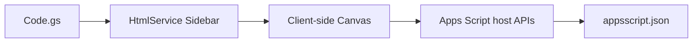

# GAS Hanko Add-on 設計書

| 項目 | 内容 |
|---|---|
| 文書名 | GAS Hanko Add-on 設計書 |
| バージョン | 1.0 |
| 作成日 | 2026-05-12 |
| 対象システム | Google Apps Script アドオン |
| 配置 | `docs/設計書.md` / `docs/設計書.xlsx` |

## 1. はじめに

本書は、`gas-hanko-addon` の目的、構成、機能、データ、セキュリティ、運用観点を引継ぎ可能な粒度で整理する設計書である。

## 2. システム概要

Google Workspace に丸型データ印を挿入する Google Apps Script アドオン

### 2.1 利用者

- Google Workspace 利用者
- アドオン管理者

### 2.2 スコープ内

- Sheets/Docs/Slides への印影挿入
- HTML サイドバー
- Canvas プレビュー
- Google アカウント情報からの初期値
- トラッキング ID 埋込

### 2.3 スコープ外

- 法的電子署名
- 印影台帳の永続保管
- 組織ワークフロー承認

## 3. アーキテクチャ

### 3.1 技術スタック

| 区分 | 採用技術 | 用途 |
|---|---|---|
| Google Apps Script | V8 runtime | appsscript.json |

### 3.2 主要ファイル

| パス | 役割 |
|---|---|
| `appsscript.json` | 設定 |
| `Code.gs` | 主要ソース/設定ファイル |
| `design_document.xlsx` | 主要ソース/設定ファイル |
| `generate_design_document.py` | 主要ソース/設定ファイル |
| `README.md` | 利用方法・概要 |
| `Sidebar.html` | 主要ソース/設定ファイル |

## 4. データ・設定モデル

| データ | 形式 | 説明 |
|---|---|---|
| 印影設定 | フォーム入力 | 上段、日付、下段 |
| 画像 | PNG data URL | 挿入用印影 |
| 追跡ID | 8桁 hex | 印影右下とステータスに表示 |

## 5. 機能仕様

| ID | 機能 | 仕様 |
|---|---|---|
| F-01 | メニュー追加 | onOpen で電子印鑑メニューを追加する。 |
| F-02 | サイドバー | Sidebar.html で入力欄とプレビューを提供する。 |
| F-03 | 印影生成 | Canvas で三段データ印を PNG 化する。 |
| F-04 | 挿入 | 対象アプリ別 API で現在位置へ画像を挿入する。 |

## 6. セキュリティ・品質

- OAuth スコープは文書操作に必要な範囲へ限定する。
- トラッキング ID は証跡補助であり法的署名ではない。

## 7. デプロイ・運用

- Apps Script エディタへ Code.gs/Sidebar.html/appsscript.json を配置
- clasp push で開発デプロイ
- 各ホストアプリで挿入動作を確認

## 8. 既知の制約と今後の拡張

- 自動変換・自動判定を含む機能は、利用者または担当者レビューを前提とする。
- 本番利用前に対象データ、権限、ログ、バックアップ、例外処理を運用環境に合わせて確認する。
- README と実装差分が出た場合は、実装側を正として本書を更新する。

## 付録 A. 改訂履歴

| 版 | 日付 | 内容 |
|---|---|---|
| 1.0 | 2026-05-12 | 初版作成 |
